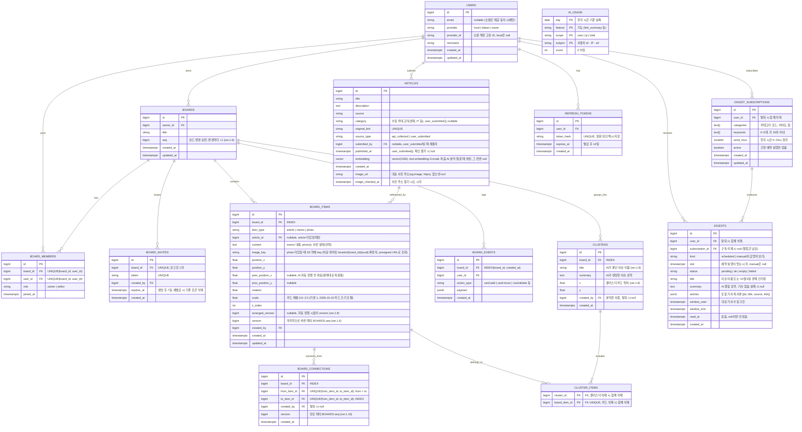

# 모여봄 — ERD / 테이블 설계

> Notion "ERD 테이블 구조" 페이지와 동기화됨 (최종 반영: 2026-10-10, ver.1.14)
>
> ver.1.1 변경: 소셜 로그인(카카오·네이버) 컬럼 추가, ARTICLES.category 추가, 임베딩 차원 확정(1536), BOARD_CONNECTIONS 중복 방지 제약 추가
>
> ver.1.2 변경 (2026-09-29): ARTICLES.submitted_by 추가·published_at nullable, BOARD_ITEMS.image_url → image_key(S3 비공개) 및 prev_position_x/y(자동 정렬 전 좌표) 추가, REFRESH_TOKENS 테이블 추가, ivfflat 인덱스는 F-04 시맨틱 검색·F-12 착수 시 HNSW로 추가하도록 보류, 시간 컬럼은 timestamptz로 통일
>
> ver.1.3 변경 (2026-10-04): 실제 마이그레이션과 맞춤 — USERS 이메일 중복 검사는 대소문자 무시(lower(email)), 가입 방식별 필수값 CHECK 추가, ARTICLES.submitted_by FK(사용자 삭제 시 null), REFRESH_TOKENS.user_id FK(사용자 삭제 시 함께 삭제)·INDEX(user_id). 구현 완료 테이블: ARTICLES, USERS, REFRESH_TOKENS
>
> ver.1.4 변경 (2026-10-04, F-05): BOARDS·BOARD_MEMBERS·BOARD_INVITES·BOARD_ITEMS·BOARD_EVENTS 구현. BOARD_INVITES는 보드당 1개(UNIQUE(board_id), 재발급 시 교체), BOARD_ITEMS는 카드 종류별 필수값 CHECK·메모 2000자 제한·INDEX(article_id), 보드 삭제 시 하위 데이터 모두 삭제(CASCADE), 사용자 삭제 시 카드 작성자·변경 기록의 user는 null. BOARD_CONNECTIONS(F-10)·CLUSTERS(F-08)·DIGEST_SUBSCRIPTIONS(F-09)는 해당 기능 구현 때 추가

> ver.1.5 변경 (2026-10-04, C-10): ARTICLES에 INDEX(created_at, id) WHERE source_type = 'api_collected' 추가 — 재연결 시 수집 순서 누락분 조회용

> ver.1.6 변경 (2026-10-04, L-02·L-05): BOARDS.seq(보드 변경 순번), BOARD_ITEMS.version(마지막 변경 순번) 추가 — 보드를 바꾸는 트랜잭션은 먼저 seq를 올려(행 잠금) 같은 보드의 변경을 커밋 순서로 줄 세운다. 실시간 이벤트 순서 비교는 updated_at이 아니라 version으로 한다

> ver.1.7 변경 (2026-10-04, F-03): AI_USAGE 테이블 추가(비용 드는 AI 호출의 하루 사용량 — 계정·IP·전체), 링크 기사(user_submitted)도 어떤 보드에도 없으면 30일 뒤 정리(C-06)

> ver.1.8 변경 (2026-10-04, F-08): CLUSTERS 구현 — title(이슈 이름)·x·y(클러스터 카드 위치)·created_by 추가, INDEX(board_id). CLUSTER_ITEMS는 (cluster_id, board_item_id) 복합 PK + board_item_id UNIQUE, 카드·클러스터 삭제 시 함께 삭제. BOARD_ITEMS.arranged_version(자동 정렬 시점의 카드 버전 — "원래대로"에서 그 뒤 직접 옮긴 카드를 구분) 추가

> ver.1.9 변경 (2026-10-05, F-04): ARTICLES에 검색용 GIN(pg_trgm) 인덱스(title || ' ' || description)와 INDEX(source) 추가 — 둘 다 api_collected만

> ver.1.10 변경 (2026-10-05, F-10): BOARD_CONNECTIONS 구현 — CHECK(from_item_id < to_item_id)로 카드 쌍을 정렬해 저장(A→B·B→A 같은 연결), version(만든 때의 보드 변경 순번) 추가, 카드·보드 삭제 시 함께 삭제, INDEX(board_id)·INDEX(to_item_id)

> ver.1.11 변경 (2026-10-05, F-09·C-08 구현): DIGEST_SUBSCRIPTIONS를 categories·keywords(text[])·send_hour(한국 시간 0~23시)·active로 바꾸고, 알림함 DIGESTS 추가(구독·받는 시각 UNIQUE로 중복 생성 방지, 상태 pending·ok·empty·failed, 포함 기사는 복사해 jsonb로 저장, read_at, 30일 보관, CHECK(scheduled면 slot 필수·manual이면 null)). 구독 삭제 시 받은 알림은 남김(subscription_id null)

> ver.1.12 변경 (2026-10-06, F-07): 이메일 가입·로그인 제거 — USERS.password_hash 삭제, UNIQUE(lower(email)) WHERE local 삭제, CHECK는 "소셜이면 provider_id 필수"로 단순화. provider='local'은 예전 이메일 계정 행(로그인 불가)으로만 남는다

> ver.1.13 변경 (2026-10-06, 기사 사진): ARTICLES.image_url(대표 사진 주소 — 언론사가 밝힌 og:image, https만, 사진 파일은 저장하지 않음)·image_checked_at(주소 찾기를 시도한 시각, 못 찾아도 기록해 다시 가져오지 않음) 추가, INDEX(created_at DESC) WHERE image_checked_at IS NULL AND api_collected
> ver.1.14 변경 (2026-10-10, F-05 사진 카드·탐정 보드): BOARD_ITEMS.scale(카드 배율 0.6~2.5, 기본 1) 추가·CHECK, 새 카드는 rotation을 -4°~+4°로 저장(기존 기울기 0 카드도 한 번 기울임), photo 카드의 content는 사진 설명(선택), image_key는 `boards/{board_id}/{uuid}.확장자`

### 1. 시각화 다이어그램 (Mermaid)

### 2. 테이블별 상세 제약 조건 (Constraints)

| 테이블 | 제약 조건 내용 | 목적 |
|---|---|---|
| USERS | UNIQUE(provider, provider_id) | 동일 소셜 계정 중복 가입 방지 (F-07) |
| USERS | CHECK(provider = 'local' OR provider_id IS NOT NULL) | 소셜 계정은 소셜 계정 ID 필수 (F-07). 'local'은 2026-10-06에 없앤 이메일 가입의 예전 행 (ver.1.12) |
| ARTICLES | UNIQUE(original_link) | 동일 기사 중복 수집 방지 (F-01) |
| ARTICLES | INDEX(category, published_at) | 카테고리별 피드·필터 조회 성능 (F-02, F-04) |
| ARTICLES | INDEX(published_at) | 전체 최신순 피드 조회 성능 (F-02) |
| ARTICLES | INDEX(created_at, id) WHERE source_type = 'api_collected' | 재연결 시 수집 순서로 누락분 조회 (F-02, ver.1.5) |
| ARTICLES | GIN((title \|\| ' ' \|\| description) gin_trgm_ops), INDEX(source) — api_collected만 | 기사 검색(앞뒤가 열린 ILIKE)·언론사 필터 (F-04, ver.1.9) |
| ARTICLES | INDEX(created_at DESC) WHERE image_checked_at IS NULL AND source_type = 'api_collected' | 아직 대표 사진 주소를 찾지 않은 최근 기사 조회 (기사 사진, ver.1.13) |
| ARTICLES | CHECK(api_collected면 category·published_at 필수) | API 수집 기사의 필수값 보장. null 허용은 user_submitted만 |
| REFRESH_TOKENS | UNIQUE(token_hash) | refresh token 조회·폐기 (F-07) |
| REFRESH_TOKENS | INDEX(user_id), FK ON DELETE CASCADE | 사용자별 토큰 조회, 탈퇴 시 토큰 함께 삭제 |
| BOARD_MEMBERS | UNIQUE(board_id, user_id) | 동일 사용자 중복 참여 방지 |
| BOARD_INVITES | UNIQUE(token) | 초대 링크 위조/충돌 방지 (F-07) |
| BOARD_INVITES | UNIQUE(board_id) | 보드당 유효한 초대 링크 1개. 재발급하면 기존 링크가 무효가 된다 (F-07) |
| BOARD_ITEMS | INDEX(board_id) | 보드 접속 시 카드 목록 빠른 조회 (F-05) |
| BOARD_ITEMS | CHECK(article→article_id, memo→content, photo→image_key 필수) | 카드 종류별 필수값 보장 (F-05) |
| BOARD_ITEMS | CHECK(scale 0.6~2.5) | 카드 배율 범위 (F-05 카드 크기, ver.1.14) |
| BOARD_ITEMS | INDEX(article_id) WHERE article_id IS NOT NULL | 30일 정리 작업에서 "보드에 올라간 기사" 확인 (F-01) |
| BOARDS | CHECK(제목 1~50자) | 보드 이름 길이 제한 (F-06). 화면·API 검증은 40자(2026-10-06 사용자 결정) |
| BOARD_EVENTS | INDEX(board_id, created_at) | 변경 이력(히스토리) 타임라인 조회 성능. 되돌리기(undo)는 F-05에서 범위 제외 |
| BOARD_CONNECTIONS | UNIQUE(from_item_id, to_item_id), CHECK(from_item_id < to_item_id) | 같은 카드 쌍 중복 연결 방지 (F-10). 저장 시 작은 id를 from으로 정렬해 A→B / B→A 중복도 방지 (ver.1.10 구현) |
| CLUSTER_ITEMS | UNIQUE(board_item_id) | 카드 하나는 동시에 하나의 클러스터에만 속함 |
| DIGEST_SUBSCRIPTIONS | CHECK(categories나 keywords 중 하나는 비어 있지 않음), CHECK(send_hour 0~23), CHECK(keywords 5개 이하), INDEX(send_hour) WHERE active | 빈 구독 방지, 시각별 실행 대상 조회 (F-09). 1인당 3개는 서비스에서 사용자 행 잠금 후 확인 |
| DIGESTS | UNIQUE(subscription_id, slot) | 같은 구독·같은 받는 시각에 다이제스트를 한 번만 만든다 — 먼저 pending 행을 넣은 실행만 진행 (F-09, C-08) |
| DIGESTS | INDEX(user_id, created_at DESC), INDEX(user_id) WHERE read_at IS NULL | 알림함 목록·안 읽은 개수 (F-09) |

### 3. 설계의 핵심 포인트

- **pgvector로 관계형+벡터 데이터 통합:** ARTICLES.embedding 컬럼에 임베딩 벡터를 그대로 저장해, 별도 벡터 DB 없이 PostgreSQL 하나로 기사 메타데이터와 AI 클러스터링용 벡터를 함께 관리. 1인 개발 규모에서 관리 포인트를 최소화. F-08 클러스터링은 보드 단위(수십 개)라 서버 메모리에서 계산하고, 벡터 인덱스(HNSW)는 전체 기사 대상 검색이 필요해질 때 추가 — F-12 질의응답은 보드의 최근 카드 200개 안에서만 찾으므로 인덱스 없이 구현(2026-10-05), F-04 검색은 낱말 검색(pg_trgm)으로 구현.
- **BOARD_ITEMS의 다형적 설계:** 기사·메모·사진 세 가지 카드 타입을 하나의 테이블에서 item_type으로 구분. article_id는 article 타입일 때만 채워지는 nullable FK로 처리해, 화이트보드 위 모든 객체(핀)를 하나의 테이블로 일관되게 관리.
- **최종 상태와 이벤트 로그의 분리:** 실시간 동기화되는 현재 상태는 BOARD_ITEMS에, 변경 이력은 별도 BOARD_EVENTS에 기록. 이렇게 분리해야 "지금 보드가 어떻게 생겼는가"와 "누가 언제 무엇을 바꿨는가"를 독립적으로 조회할 수 있고, 추후 되돌리기(undo)·타임라인 재생 기능 확장이 쉬움.
- **AI 클러스터링과 수동 조정의 느슨한 결합:** 클러스터 결과는 CLUSTERS/CLUSTER_ITEMS로 별도 저장하고, 사용자가 카드를 수동으로 옮겨도 BOARD_ITEMS의 좌표만 바뀔 뿐 클러스터 소속 정보는 그대로 유지. AI 제안과 사용자 조정이 서로 충돌하지 않는 구조.
- **저작권 고려:** ARTICLES는 본문 전체가 아닌 title/description(요약)+original_link만 저장하는 스키마로 설계, 데이터 모델 단계에서부터 저작권 리스크를 관리. 기사 대표 사진도 파일은 저장하지 않고 언론사가 공개한 주소만 저장(ver.1.13).
