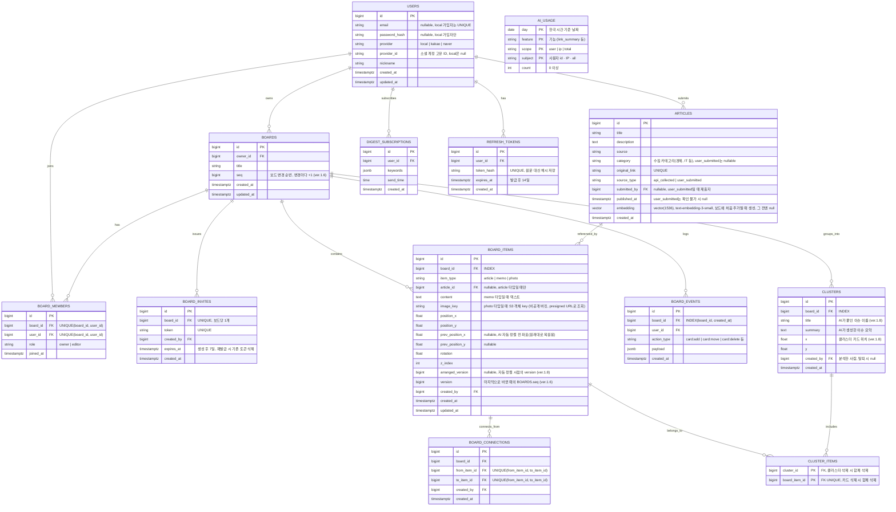

# 모여봄 — ERD / 테이블 설계

> Notion "ERD 테이블 구조" 페이지와 동기화됨 (최종 반영: 2026-10-04, ver.1.8)
>
> ver.1.1 변경: 소셜 로그인(카카오·네이버) 컬럼 추가, ARTICLES.category 추가, 임베딩 차원 확정(1536), BOARD_CONNECTIONS 중복 방지 제약 추가
>
> ver.1.2 변경 (2026-09-29): ARTICLES.submitted_by 추가·published_at nullable, BOARD_ITEMS.image_url → image_key(S3 비공개) 및 prev_position_x/y(자동 정렬 전 좌표) 추가, REFRESH_TOKENS 테이블 추가, ivfflat 인덱스는 F-04 시맨틱 검색·F-12 착수 시 HNSW로 추가하도록 보류, 시간 컬럼은 timestamptz로 통일
>
> ver.1.3 변경 (2026-10-04): 실제 마이그레이션과 맞춤 — USERS 이메일 중복 검사는 대소문자 무시(lower(email)), 가입 방식별 필수값 CHECK 추가, ARTICLES.submitted_by FK(사용자 삭제 시 null), REFRESH_TOKENS.user_id FK(사용자 삭제 시 함께 삭제)·INDEX(user_id). 구현 완료 테이블: ARTICLES, USERS, REFRESH_TOKENS
>
> ver.1.4 변경 (2026-10-04, F-05): BOARDS·BOARD_MEMBERS·BOARD_INVITES·BOARD_ITEMS·BOARD_EVENTS 구현. BOARD_INVITES는 보드당 1개(UNIQUE(board_id), 재발급 시 교체), BOARD_ITEMS는 카드 종류별 필수값 CHECK·메모 2000자 제한·INDEX(article_id), 보드 삭제 시 하위 데이터 모두 삭제(CASCADE), 사용자 삭제 시 카드 작성자·변경 기록의 user는 null. BOARD_CONNECTIONS(F-10)·CLUSTERS(F-08)·DIGEST_SUBSCRIPTIONS(F-09)는 해당 기능 구현 때 추가

> ver.1.5 변경 (2026-10-04, C-10): ARTICLES에 INDEX(created_at, id) WHERE source_type = 'api_collected' 추가 — 재연결 시 수집 순서 누락분 조회용

> ver.1.8 변경 (2026-10-04, F-08): CLUSTERS 구현 — title(이슈 이름)·x·y(클러스터 카드 위치)·created_by 추가, INDEX(board_id). CLUSTER_ITEMS는 (cluster_id, board_item_id) 복합 PK + board_item_id UNIQUE, 카드·클러스터 삭제 시 함께 삭제. BOARD_ITEMS.arranged_version(자동 정렬 시점의 카드 버전 — "원래대로"에서 그 뒤 직접 옮긴 카드를 구분) 추가

> ver.1.7 변경 (2026-10-04, F-03): AI_USAGE 테이블 추가(비용 드는 AI 호출의 하루 사용량 — 계정·IP·전체), 링크 기사(user_submitted)도 어떤 보드에도 없으면 30일 뒤 정리(C-06)

> ver.1.6 변경 (2026-10-04, L-02·L-05): BOARDS.seq(보드 변경 순번), BOARD_ITEMS.version(마지막 변경 순번) 추가 — 보드를 바꾸는 트랜잭션은 먼저 seq를 올려(행 잠금) 같은 보드의 변경을 커밋 순서로 줄 세운다. 실시간 이벤트 순서 비교는 updated_at이 아니라 version으로 한다

### 1. 시각화 다이어그램 (Mermaid)

### 2. 테이블별 상세 제약 조건 (Constraints)

| 테이블 | 제약 조건 내용 | 목적 |
|---|---|---|
| USERS | UNIQUE(lower(email)) WHERE provider = 'local' | 이메일 중복 가입 방지, 대소문자 무시 (F-07). 카카오는 이메일 제공이 선택 동의라 소셜 계정은 email이 null일 수 있음 |
| USERS | UNIQUE(provider, provider_id) | 동일 소셜 계정 중복 가입 방지 (F-07) |
| USERS | CHECK(local이면 email·password_hash 필수 / 소셜이면 provider_id 필수·password_hash 없음) | 가입 방식별 필수값 보장 (F-07) |
| ARTICLES | UNIQUE(original_link) | 동일 기사 중복 수집 방지 (F-01) |
| ARTICLES | INDEX(category, published_at) | 카테고리별 피드·필터 조회 성능 (F-02, F-04) |
| ARTICLES | INDEX(published_at) | 전체 최신순 피드 조회 성능 (F-02) |
| ARTICLES | INDEX(created_at, id) WHERE source_type = 'api_collected' | 재연결 시 수집 순서로 누락분 조회 (F-02, ver.1.5) |
| ARTICLES | CHECK(api_collected면 category·published_at 필수) | API 수집 기사의 필수값 보장. null 허용은 user_submitted만 |
| REFRESH_TOKENS | UNIQUE(token_hash) | refresh token 조회·폐기 (F-07) |
| REFRESH_TOKENS | INDEX(user_id), FK ON DELETE CASCADE | 사용자별 토큰 조회, 탈퇴 시 토큰 함께 삭제 |
| BOARD_MEMBERS | UNIQUE(board_id, user_id) | 동일 사용자 중복 참여 방지 |
| BOARD_INVITES | UNIQUE(token) | 초대 링크 위조/충돌 방지 (F-07) |
| BOARD_INVITES | UNIQUE(board_id) | 보드당 유효한 초대 링크 1개. 재발급하면 기존 링크가 무효가 된다 (F-07) |
| BOARD_ITEMS | INDEX(board_id) | 보드 접속 시 카드 목록 빠른 조회 (F-05) |
| BOARD_ITEMS | CHECK(article→article_id, memo→content, photo→image_key 필수) | 카드 종류별 필수값 보장 (F-05) |
| BOARD_ITEMS | INDEX(article_id) WHERE article_id IS NOT NULL | 30일 정리 작업에서 "보드에 올라간 기사" 확인 (F-01) |
| BOARDS | CHECK(제목 1~50자) | 보드 이름 길이 제한 (F-06) |
| BOARD_EVENTS | INDEX(board_id, created_at) | 변경 이력(히스토리) 타임라인 조회 성능. 되돌리기(undo)는 F-05에서 범위 제외 |
| BOARD_CONNECTIONS | UNIQUE(from_item_id, to_item_id) | 같은 카드 쌍 중복 연결 방지 (F-10). 저장 시 작은 id를 from으로 정렬해 A→B / B→A 중복도 방지 |
| CLUSTER_ITEMS | UNIQUE(board_item_id) | 카드 하나는 동시에 하나의 클러스터에만 속함 |

### 3. 설계의 핵심 포인트

- **pgvector로 관계형+벡터 데이터 통합:** ARTICLES.embedding 컬럼에 임베딩 벡터를 그대로 저장해, 별도 벡터 DB 없이 PostgreSQL 하나로 기사 메타데이터와 AI 클러스터링용 벡터를 함께 관리. 1인 개발 규모에서 관리 포인트를 최소화. F-08 클러스터링은 보드 단위(수십 개)라 서버 메모리에서 계산하고, 벡터 인덱스(HNSW)는 전체 기사 대상 검색이 필요한 F-04 시맨틱 검색·F-12 RAG 착수 시 추가.
- **BOARD_ITEMS의 다형적 설계:** 기사·메모·사진 세 가지 카드 타입을 하나의 테이블에서 item_type으로 구분. article_id는 article 타입일 때만 채워지는 nullable FK로 처리해, 화이트보드 위 모든 객체(핀)를 하나의 테이블로 일관되게 관리.
- **최종 상태와 이벤트 로그의 분리:** 실시간 동기화되는 현재 상태는 BOARD_ITEMS에, 변경 이력은 별도 BOARD_EVENTS에 기록. 이렇게 분리해야 "지금 보드가 어떻게 생겼는가"와 "누가 언제 무엇을 바꿨는가"를 독립적으로 조회할 수 있고, 추후 되돌리기(undo)·타임라인 재생 기능 확장이 쉬움.
- **AI 클러스터링과 수동 조정의 느슨한 결합:** 클러스터 결과는 CLUSTERS/CLUSTER_ITEMS로 별도 저장하고, 사용자가 카드를 수동으로 옮겨도 BOARD_ITEMS의 좌표만 바뀔 뿐 클러스터 소속 정보는 그대로 유지. AI 제안과 사용자 조정이 서로 충돌하지 않는 구조.
- **저작권 고려:** ARTICLES는 본문 전체가 아닌 title/description(요약)+original_link만 저장하는 스키마로 설계, 데이터 모델 단계에서부터 저작권 리스크를 관리.
