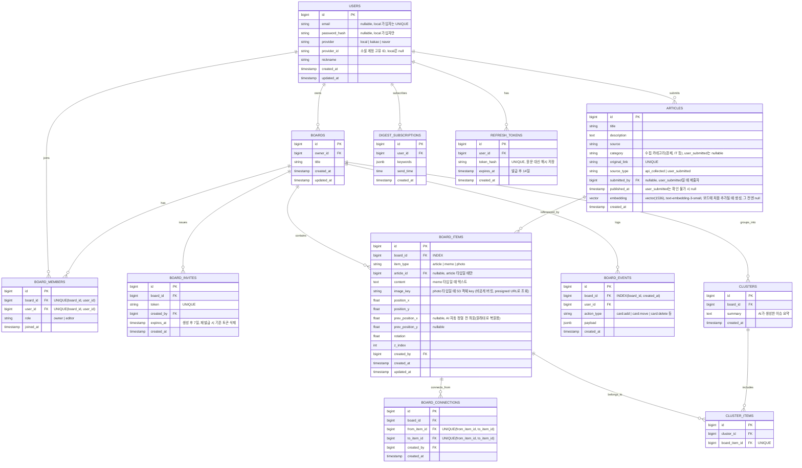

# 모여봄 — ERD / 테이블 설계

> Notion "ERD 테이블 구조" 페이지와 동기화됨 (최종 반영: 2026-09-29, ver.1.2)
>
> ver.1.1 변경: 소셜 로그인(카카오·네이버) 컬럼 추가, ARTICLES.category 추가, 임베딩 차원 확정(1536), BOARD_CONNECTIONS 중복 방지 제약 추가
>
> ver.1.2 변경 (2026-09-29): ARTICLES.submitted_by 추가·published_at nullable, BOARD_ITEMS.image_url → image_key(S3 비공개) 및 prev_position_x/y(자동 정렬 전 좌표) 추가, REFRESH_TOKENS 테이블 추가, ivfflat 인덱스는 F-04 시맨틱 검색·F-12 착수 시 HNSW로 추가하도록 보류, 시간 컬럼은 timestamptz로 통일

### 1. 시각화 다이어그램 (Mermaid)

### 2. 테이블별 상세 제약 조건 (Constraints)

| 테이블 | 제약 조건 내용 | 목적 |
|---|---|---|
| USERS | UNIQUE(email) WHERE provider = 'local' | 이메일 중복 가입 방지 (F-07). 카카오는 이메일 제공이 선택 동의라 소셜 계정은 email이 null일 수 있음 |
| USERS | UNIQUE(provider, provider_id) | 동일 소셜 계정 중복 가입 방지 (F-07) |
| ARTICLES | UNIQUE(original_link) | 동일 기사 중복 수집 방지 (F-01) |
| ARTICLES | INDEX(category, published_at) | 카테고리별 피드·필터 조회 성능 (F-02, F-04) |
| REFRESH_TOKENS | UNIQUE(token_hash) | refresh token 조회·폐기 (F-07) |
| BOARD_MEMBERS | UNIQUE(board_id, user_id) | 동일 사용자 중복 참여 방지 |
| BOARD_INVITES | UNIQUE(token) | 초대 링크 위조/충돌 방지 (F-07) |
| BOARD_ITEMS | INDEX(board_id) | 보드 접속 시 카드 목록 빠른 조회 (F-05) |
| BOARD_EVENTS | INDEX(board_id, created_at) | 히스토리/되돌리기용 타임라인 조회 성능 |
| BOARD_CONNECTIONS | UNIQUE(from_item_id, to_item_id) | 같은 카드 쌍 중복 연결 방지 (F-10). 저장 시 작은 id를 from으로 정렬해 A→B / B→A 중복도 방지 |
| CLUSTER_ITEMS | UNIQUE(board_item_id) | 카드 하나는 동시에 하나의 클러스터에만 속함 |

### 3. 설계의 핵심 포인트

- **pgvector로 관계형+벡터 데이터 통합:** ARTICLES.embedding 컬럼에 임베딩 벡터를 그대로 저장해, 별도 벡터 DB 없이 PostgreSQL 하나로 기사 메타데이터와 AI 클러스터링용 벡터를 함께 관리. 1인 개발 규모에서 관리 포인트를 최소화. F-08 클러스터링은 보드 단위(수십 개)라 서버 메모리에서 계산하고, 벡터 인덱스(HNSW)는 전체 기사 대상 검색이 필요한 F-04 시맨틱 검색·F-12 RAG 착수 시 추가.
- **BOARD_ITEMS의 다형적 설계:** 기사·메모·사진 세 가지 카드 타입을 하나의 테이블에서 item_type으로 구분. article_id는 article 타입일 때만 채워지는 nullable FK로 처리해, 화이트보드 위 모든 객체(핀)를 하나의 테이블로 일관되게 관리.
- **최종 상태와 이벤트 로그의 분리:** 실시간 동기화되는 현재 상태는 BOARD_ITEMS에, 변경 이력은 별도 BOARD_EVENTS에 기록. 이렇게 분리해야 "지금 보드가 어떻게 생겼는가"와 "누가 언제 무엇을 바꿨는가"를 독립적으로 조회할 수 있고, 추후 되돌리기(undo)·타임라인 재생 기능 확장이 쉬움.
- **AI 클러스터링과 수동 조정의 느슨한 결합:** 클러스터 결과는 CLUSTERS/CLUSTER_ITEMS로 별도 저장하고, 사용자가 카드를 수동으로 옮겨도 BOARD_ITEMS의 좌표만 바뀔 뿐 클러스터 소속 정보는 그대로 유지. AI 제안과 사용자 조정이 서로 충돌하지 않는 구조.
- **저작권 고려:** ARTICLES는 본문 전체가 아닌 title/description(요약)+original_link만 저장하는 스키마로 설계, 데이터 모델 단계에서부터 저작권 리스크를 관리.
